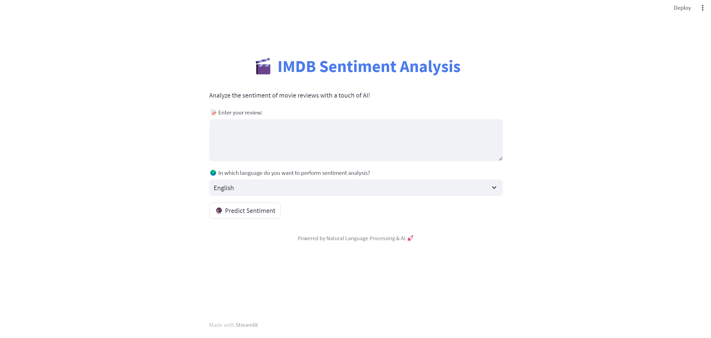

# 🎬 IMDB Sentiment Analysis

Welcome to the **IMDB Sentiment Analysis** project! This application utilizes advanced Natural Language Processing (NLP) techniques to analyze and classify movie and TV show reviews from IMDB as either positive or negative. The system is powered by a robust machine learning model and offers an intuitive user experience through a modern Streamlit interface.

  <!-- Add an image relevant to your project -->

## 🚀 Features

- **Sentiment Classification**: Accurately categorizes reviews into positive or negative sentiments.
- **Multi-Language Support**: Analyze reviews in both English and Turkish, with automatic translation.
- **Interactive Web Interface**: User-friendly interface built with Streamlit for real-time sentiment analysis.

## 🛠 Technologies Used

- **Python**: Core programming language.
- **Pandas**: For data manipulation and analysis.
- **NumPy**: Numerical computing.
- **Scikit-learn**: Machine learning library for model training and evaluation.
- **NLTK**: Text preprocessing and NLP tasks.
- **BeautifulSoup**: HTML parsing and text extraction.
- **Streamlit**: Framework for creating interactive web applications.
- **Pickle**: Model and vectorizer serialization.
- **Google Translate API**: For translating reviews into English.

## 📁 Project Structure

- **`data/`**: Contains `NLPlabeledData.tsv`, the dataset used for training the sentiment model.
- **`model/`**: Includes `sentiment_model.pkl` and `vectorizer.pkl` for the trained model and feature extraction.
- **`app.py`**: Streamlit application file providing the web interface for sentiment analysis.
- **`training.py`**: Scripts for data cleaning and preprocessing.

## 🌟 Getting Started

### Prerequisites

Ensure you have Python 3.9 or higher. Install the necessary libraries listed in `requirements.txt`.

## 🔍 Usage

1. **Enter Review**: Input your movie or TV show review in the text area.
2. **Select Language**: Choose between English and Turkish for sentiment analysis.
3. **Predict Sentiment**: Click the "Predict Sentiment" button to view the result.

## 📦 Model and Vectorizer

The trained sentiment analysis model and vectorizer are serialized using `pickle` and are available as `sentiment_model.pkl` and `vectorizer.pkl`. These files are essential for making predictions with the trained model.

## 🙌 Acknowledgements

- **IMDB**: For providing the dataset.
- **Streamlit**: For the interactive application framework.
- **NLTK, Scikit-learn, and BeautifulSoup**: For their invaluable tools and libraries.

## 📧 Contact

For any inquiries, feedback, or contributions, please reach out:

- **Email**: [hasancan.celik6241@gmail.com](mailto:hasancan.celik6241@gmail.com)
- **GitHub**: [Hasan Can Çelik](https://github.com/HasanCan6241)

---

Thank you for exploring the IMDB Sentiment Analysis project! We hope you find it useful and insightful.
